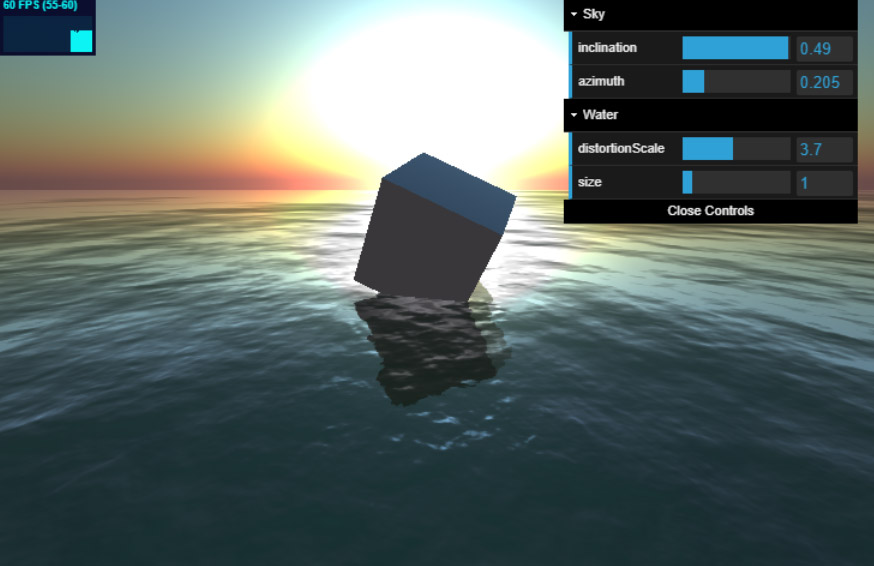

# Three.js Boilerplate

A Three.js Boilerplate to aid in quick prototyping.

When updating older Three.js projects, you may get a warning in the browser such as,
"As part of the transition to ES6 Modules, the files in 'examples/js' were deprecated in May 2020 (r117) and will be deleted in December 2020 (r124)."

There are several steps involved in converting to use modules. This boilerplate was written to help you solve some of the issues you may have when converting your Three.js projects to use modules.

To install and start the master (ES6) branch

```bash
git clone https://github.com/Sean-Bradley/Threejs-Boilerplate.git
cd Threejs-Boilerplate
npm install
npm start
```

Visit http://127.0.0.1:3000

[View example on CodeSandbox.io](https://codesandbox.io/s/github/Sean-Bradley/Threejs-Boilerplate/tree/master/)

To update threejs

```
npm install three@latest
```

**Note** : This boilerplate contains 3 branches

-   master : The minimal boilerplate using ES6 imports and script type module
-   before-es6-modules : The example, but using older style script imports
-   water : An example based on the official [Three.js Ocean example](https://threejs.org/examples/?q=water#webgl_shaders_ocean)

To see the `before-es6-modules` branch

```bash
git checkout before-es6-modules
npm install
npm start
```

To see the `water` branch

```bash
git checkout water
npm install
npm start
```



### Video Tutorial About Importing Three.js as Module

[](https://youtu.be/z9qtGHTqLqQ)

## Threejs TypeScript Course

Visit https://github.com/Sean-Bradley/Three.js-TypeScript-Boilerplate for a Threejs TypeScript boilerplate containing many extra branches that demonstrate many examples of Threejs.

> To help support this Threejs boilerplate, please take a moment to look at my official Threejs TypeScript course at

[](https://www.udemy.com/course/threejs-tutorials/?referralCode=4C7E1DE91C3E42F69D0F)

[Three.js and TypeScript](https://www.udemy.com/course/threejs-tutorials/?referralCode=4C7E1DE91C3E42F69D0F)<br/>  
 Discount Coupons for all my courses can be found at [https://sbcode.net/coupons](https://sbcode.net/coupons)

## Relative Import References versus Module Specifiers

If you ever see the error "Relative references must start with either "/", "./", or "../".", then that may also be related to using Module Specifiers in the client, when it was expecting a Relative Import Reference instead. You can read more about Relative Imports versus Module Specifiers at https://medium.com/threejs/module-specifiers-versus-relative-import-references-fd747980ba6f

# Programming Books

To help support my projects, please check out my books.

## Three.js and TypeScript


&nbsp;<a href="https://www.amazon.com/dp/B09GYTKRCH">&nbsp; https://www.amazon.com/dp/B09GYTKRCH</a><br/>
&nbsp;<a href="https://www.amazon.co.uk/dp/B09GYTKRCH">&nbsp; https://www.amazon.co.uk/dp/B09GYTKRCH</a><br/>
&nbsp;<a href="https://www.amazon.in/dp/B09GYTKRCH">&nbsp; https://www.amazon.in/dp/B09GYTKRCH</a><br/>
&nbsp;<a href="https://www.amazon.de/dp/B09GYTKRCH">&nbsp; https://www.amazon.de/dp/B09GYTKRCH</a><br/>
&nbsp;<a href="https://www.amazon.fr/dp/B09GYTKRCH">&nbsp; https://www.amazon.fr/dp/B09GYTKRCH</a><br/>
&nbsp;<a href="https://www.amazon.es/dp/B09GYTKRCH">&nbsp; https://www.amazon.es/dp/B09GYTKRCH</a><br/>
&nbsp;<a href="https://www.amazon.it/dp/B09GYTKRCH">&nbsp; https://www.amazon.it/dp/B09GYTKRCH</a><br/>
&nbsp;<a href="https://www.amazon.nl/dp/B09GYTKRCH">&nbsp; https://www.amazon.nl/dp/B09GYTKRCH</a><br/>
&nbsp;<a href="https://www.amazon.co.jp/dp/B09GYTKRCH">&nbsp; https://www.amazon.co.jp/dp/B09GYTKRCH</a><br/>
&nbsp;<a href="https://www.amazon.ca/dp/B09GYTKRCH">&nbsp; https://www.amazon.ca/dp/B09GYTKRCH</a><br/>
&nbsp;<a href="https://www.amazon.com.br/dp/B09GYTKRCH">&nbsp; https://www.amazon.com.br/dp/B09GYTKRCH</a><br/>
&nbsp;<a href="https://www.amazon.com.mx/dp/B09GYTKRCH">&nbsp; https://www.amazon.com.mx/dp/B09GYTKRCH</a><br/>
&nbsp;<a href="https://www.amazon.com.au/dp/B09GYTKRCH">&nbsp; https://www.amazon.com.au/dp/B09GYTKRCH</a>

(ASIN : B09GZM9KGJ / B09GYTKRCH)

## Design Patterns in TypeScript


&nbsp;<a href="https://www.amazon.com/dp/B0948BCH24">&nbsp; https://www.amazon.com/dp/B0948BCH24</a><br/>
&nbsp;<a href="https://www.amazon.co.uk/dp/B0948BCH24">&nbsp; https://www.amazon.co.uk/dp/B0948BCH24</a><br/>
&nbsp;<a href="https://www.amazon.in/dp/B094716FD6">&nbsp; https://www.amazon.in/dp/B094716FD6</a><br/>
&nbsp;<a href="https://www.amazon.de/dp/B0948BCH24">&nbsp; https://www.amazon.de/dp/B0948BCH24</a><br/>
&nbsp;<a href="https://www.amazon.fr/dp/B0948BCH24">&nbsp; https://www.amazon.fr/dp/B0948BCH24</a><br/>
&nbsp;<a href="https://www.amazon.es/dp/B0948BCH24">&nbsp; https://www.amazon.es/dp/B0948BCH24</a><br/>
&nbsp;<a href="https://www.amazon.it/dp/B0948BCH24">&nbsp; https://www.amazon.it/dp/B0948BCH24</a><br/>
&nbsp;<a href="https://www.amazon.co.jp/dp/B0948BCH24">&nbsp; https://www.amazon.co.jp/dp/B0948BCH24</a><br/>
&nbsp;<a href="https://www.amazon.ca/dp/B0948BCH24">&nbsp; https://www.amazon.ca/dp/B0948BCH24</a><br/>
&nbsp;<a href="https://www.amazon.com.au/dp/B094716FD6">&nbsp; https://www.amazon.com.au/dp/B094716FD6</a>

(ASIN : B0948BCH24 / B094716FD6)
